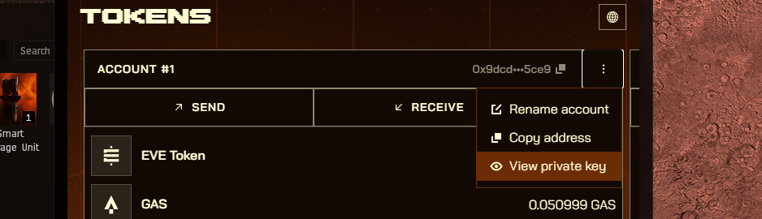

# Smart Gate Example

## Introduction
This guide will walk you through the process of building contracts for a Smart Gate, deploying them into an existing world running, and testing their functionality by executing scripts.

The Smart Gate allows players to create player made transport gates, connecting systems and regions. It also features configuration options to allow specific players to use it. 

This example shows how to create a Smart Gate that only allows members of a specific corporation to use the Smart Gate.

You can use [Deployment and Testing in Local](#Local) to test the example on your computer and [Deployment to Stillness](#Stillness) to deploy it to the game.

### Additional Information

For additional information on the Smart Gate you can visit: [https://docs.evefrontier.com/SmartAssemblies/SmartGate](https://docs.evefrontier.com/SmartAssemblies/SmartGate).

## Deployment and Testing in Local<a id='Local'></a>
### Step 0: Deploy the example contracts to the existing world
First, copy the World Contract Address from the Docker logs obtained in the previous step, then run the following commands:


Move to the example directory with:

```bash
cd smart-gate
```

Then install the Solidity dependencies for the contracts:
```bash
pnpm install
```

This will deploy the contracts to a forked version of your local world for testing.
```bash
pnpm dev
```

Once deployment is successful, you'll see a screen similar to the one below. This process creates a forked version of the local world and deploys the Smart Turret contracts.


The forked local world means that any changes that happen when running pnpm dev are reverted when closing it, allowing you to quickly reset and try something different.

### Step 1: Mock data for the existing world **(Local Development Only)**
Click on the "shell" process and then click on the main terminal window. 

To generate mock data for testing the Smart Gate logic on the local world, run the following command:


```bash
pnpm mock-data
```

This will create the on-chain Gates, fuel them, bring them online, and create a test smart character.

### Step 2: Configure Smart Gate
To configure which smart gates will be used, run:

```bash
pnpm configure-smart-gate
```

You can adjust the values for the SSU_ID, in and out item ID's and the ratios in the .env file as needed, though they are optional.

### Step 3: Link Gates
To use the smart gates, you need to link them together to create a connection. To link the source and destination gates use:

```bash copy
pnpm link-gates
```

### Step 4: Test The Smart Gate (Optional)
To test the smart gate and check the canJump, use the following command:

```bash
pnpm execute
```

## Deployment to Stillness<a id='Stillness'></a>
### Step 0: Deploy the example contracts to Stillness
Move to the example directory with:

```bash
cd smart-gate/packages/contracts
```

Then install the Solidity dependencies for the contracts:
```bash
pnpm install
```

Next, convert the [.env](./packages/contracts/.env) **WORLD_ADDRESS** and **RPC_URL** value to point to Stillness using: 

```bash
pnpm env-stillness
```

Now replace the private key in the [.env](./packages/contracts/.env) file. Get your recovery phrase from the game wallet, import into EVE Wallet and then retrieve the private key as visible in the image below.



```bash
PRIVATE_KEY=0xac0974bec39a17e36ba4a6b4d238ff944bacb478cbed5efcae784d7bf4f2ff80
```

Then deploy the contract using:

```bash
pnpm run deploy:garnet
```

Once the deployment is successful, you'll see a screen similar to the one below. This process deploys the Smart Gate contracts. 


### Step 1: Setup the environment variables 
Next, replace the following values in the [.env](./packages/contracts/.env) file with the below steps.

For Stillness, the smart gate id is available once you have deployed an Smart Gate in the game. Right click your Smart Gate, click Interact and open the dapp window and copy the smart gate id.

```bash
# Copy this info from in game smart gate
SOURCE_GATE_ID=34818344039668088032259299209624217066809194721387714788472158182502870248994

# Copy this info from in game smart gate
DESTINATION_GATE_ID=67387866010353549996346280963079126762450299713900890730943797543376801696007
```

Now set the allowed corp ID variable. You can retrieve the Corp ID by:
1. Retrieve your character address from searching your username here: [Smart Characters World API](https://blockchain-gateway-stillness.live.tech.evefrontier.com/smartcharacters)
2. Use this link: https://blockchain-gateway-stillness.live.tech.evefrontier.com/smartcharacters/ADDRESS and replace **"ADDRESS"** with the address from the previous step.
3. Use the **"corpId"** value which should be in:
```json
{
    "address": "0x9dcd62f5c02e7066a3154bc3ba029e85345a5ce9",
    "id": "27968150122480120904130498262405934486185445355744041492535994892832439518842",
    "corpId": "98000002",
    "name": "CCP Red Dragon",
    ...
```

```bash
# Copy this information from your Smart Character corp ID
ALLOWED_CORP_ID=3434306
```

### Step 2: Configure Smart Gate
To configure which smart gates will be used, run:

```bash
pnpm configure-smart-gates
```

You can alter the gate ID's and the allowed corp in the .env file as needed.

### Troubleshooting

If you encounter any issues, refer to the troubleshooting tips below:

1. **World Address Mismatch**: Double-check that the `WORLD_ADDRESS` is correctly updated in the `contracts/.env` file. Make sure you are deploying contracts to the correct world.
   
2. **Anvil Instance Conflicts**: Ensure there is only one running instance of Anvil. The active instance should be initiated via the `docker compose up -d` command. Multiple instances of Anvil may cause unexpected behavior or deployment errors.

3. **Not able to jump even though it's the correct corp**: Ensure you have set the correct corp ID set in the `contracts/.env` file.  

### Still having issues?
If you are still having issues, then visit [the documentation website](https://docs.evefrontier.com/Troubleshooting) for more general troubleshooting tips.