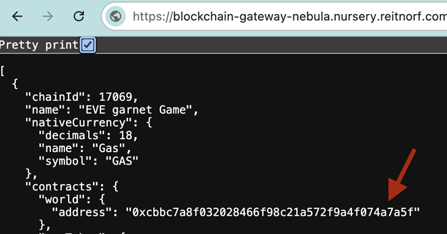

# Smart Storage Unit Example

## Introduction
This guide will walk you through the process of building contracts for a Smart Storage Unit, deploying them into an existing world running, and testing their functionality by executing scripts.

A Smart Storage Unit can be configured to automatically to trade items between the owner and other players. Exchange quantity are set by providing a ratio of items. For example with a ratio of 1:2 you can exchange, 1 ore for 2 mining crystals.

You can use [Deployment and Testing in Local](#Local) to test the example on your computer and [Deployment to Nebula / Nova](#Nebula) to deploy it to the game.

### Additional Information

For additional information on the Smart Storage Unit you can visit: [https://docs.evefrontier.com/SmartAssemblies/SmartStorageUnit](https://docs.evefrontier.com/SmartAssemblies/SmartStorageUnit).

## Deployment and Testing in Local<a id='Local'></a>
### Step 0: Deploy the example contracts to the existing world
First, copy the World Contract Address from the Docker logs obtained in the previous step, then run the following commands:


Move to the example directory with:

```bash
cd smart-storage-unit
```

Then install the Solidity dependencies for the contracts:
```bash
pnpm install
```

This will deploy the contracts to a forked version of your local world for testing.
```bash
pnpm dev
```

### Step 1: Tests for the existing world **(Local Development Only)**
To run tests to make sure that the SSU example is working, you can click on the shell process as seen in the image below, click in the terminal and then run:


```bash
pnpm test
```


You should then see the tests pass:


## Deployment to Nebula / Nova<a id='Nebula'></a>
### Step 0: Deploy the example contracts to Nova or Nebula
Move to the example directory with:

```bash
cd smart-storage-unit/packages/contracts
```

Then install the Solidity dependencies for the contracts:
```bash
pnpm install
```

Next, retrieve the world address through the below links depending on which server you want to deploy to and then replace <worldAddress> with the world address. 

- [Nebula World Address](https://blockchain-gateway-nebula.nursery.reitnorf.com/config)
- [Nova World Address](https://blockchain-gateway-nova.nursery.reitnorf.com/config)

<br />

```bash
pnpm run deploy:garnet --worldAddress <worldAddress> 
```

eg: `pnpm deploy:garnet --worldAddress 0xafc8e4fd5eee66590c93feebf526e1aa2e93c6c3`

Once the deployment is successful, you'll see a screen similar to the one below. This process deploys the SSU contract. 


### Step 1: Setup the environment variables 
Next, replace the following values in the [.env](./packages/contracts/.env) file with the respective values 

You can change values in the .env file for Nova and Nebula, though they are optional for local testing.

For Nova and Nebula, Get your recovery phrase from the game wallet, import into EVE Wallet and then grab the private key from there.

```bash
PRIVATE_KEY=0xac0974bec39a17e36ba4a6b4d238ff944bacb478cbed5efcae784d7bf4f2ff80
```

For Nova and Nebula, get the world address from the configs. You can deploy your own ERC20 token or use the EVE Token address in the config



```bash
#WORLD ADDRESS COPIED FROM DOCKER LOGS FOR LOCAL
WORLD_ADDRESS=
```

For Nova or Nebula, the Smart Storage Unit ID (SSU ID) is available once you have deployed an SSU in the game.

Right click your Smart Storage Unit, and open the dapp window and copy the smart storage unit id.


```bash
#DONT NEED TO CHANGE IF YOUR RUNNING LOCALLY
SSU_ID=34818344039668088032259299209624217066809194721387714788472158182502870248994
```

To get the Item ID's you can use https://blockchain-gateway-nebula.nursery.reitnorf.com/types and then search for the item name.

You can use the "smartItemId" as the Item ID below.

```json
"83839": {
        "name": "Salt",
        "description": "Computational Salt is a crystalline substance primarily used in exotronic computing. It is one of the products of Crude Matter industry. The larger the crystal, the more massive models for computation it can contain, but we are still talking about microscopic sizes invisible to the naked human eye.",
        "smartItemId": "70505200487489129491533272716910408603753256595363780714882065332876101173161",
        "attributes": [
            {
                "trait_type": "typeID",
                "value": 83839
            },
            ...
        ]
}
```

```bash
#ITEM IN : SALT
ITEM_IN_ID=70505200487489129491533272716910408603753256595363780714882065332876101173161
#ITEM OUT : LENS
ITEM_OUT_ID=112603025077760770783264636189502217226733230421932850697496331082050661822826
```

A ratio with the in being 1 and out being 2 means that for every item a player puts into the deployable, they get two items from it. 

You can alter this ratio how you want, but be careful not to accidentally give away your whole supply of items with the wrong ratio.

```bash
#IN Ratio
IN_RATIO=1
#OUT Ratio
OUT_RATIO=2
```

### Step 2: Configure SSU
To configure which items should be traded and the ratio's to trade for run:

```bash
pnpm configure-ratio
```

You can adjust the values for the SSU_ID, in and out item ID's and the ratios in the .env file as needed, though they are optional.

### Step 3: Execute the trade
To trade items, make sure the items are in the inventories and then you need to run:

```bash
pnpm execute
```

### Troubleshooting

If you encounter any issues, refer to the troubleshooting tips below:

1. **World Address Mismatch**: Double-check that the `WORLD_ADDRESS` is correctly updated in the `contracts/.env` file. Make sure you are deploying contracts to the correct world.
   
2. **Anvil Instance Conflicts**: Ensure there is only one running instance of Anvil. The active instance should be initiated via the `docker compose up -d` command. Multiple instances of Anvil may cause unexpected behavior or deployment errors.

3. **Trade Quantity Is Incorrect**: Ensure your input and output ratios have been correctly set in the `contracts/.env` file.  

### Still having issues?
If you are still having issues, then visit [the documentation website](https://docs.evefrontier.com/Troubleshooting) for more general troubleshooting tips.